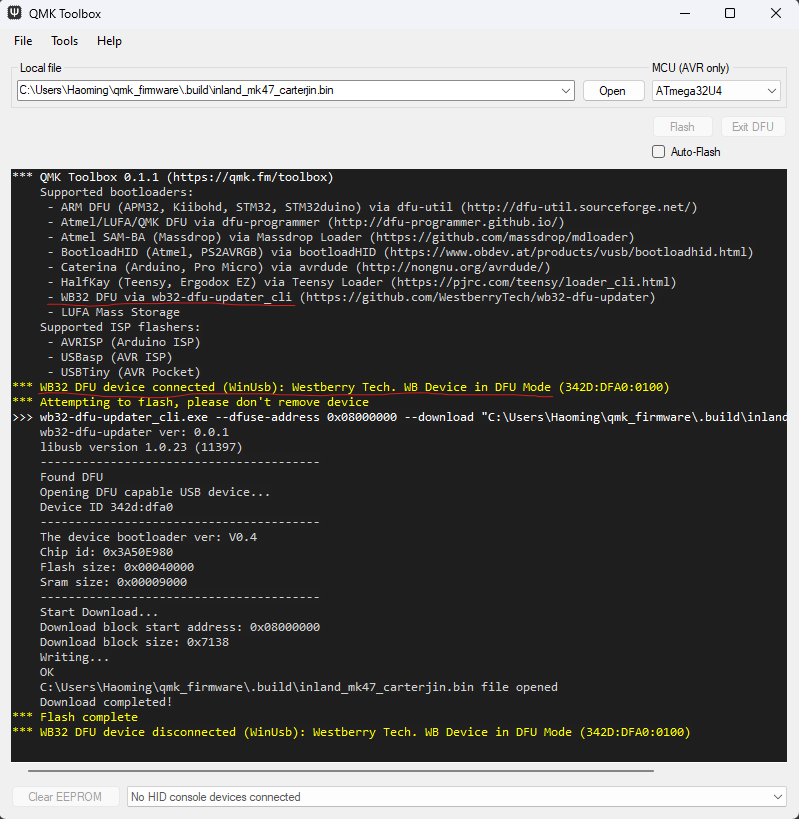

# Inland-MK47-keyboard-QMK-VIA-setup
I read about this Inland MK47 planck type keyboard, all assembled with per key RGB for only $40 on reddit, available in microcenter in store, and the second day I went there and I got the last one in that store. No doubt a very good deal. Looks like really less and less people are interested in Planck form, with the EZ planck also discontinued, and this keyboard with such great value still out of stock almost everywhere.
The keyboard works right out of the box, but to setup your custom keymap may need some effort and the information you can find online is very limited. So I will share my experience and post the steps and pitfalls I met during the process.

Some useful info about this keyboard:
1. Keycap profile is DSA.
2. The microcontroller is WestBerry wb32fq95.
3. RGB is per key RGB.
4. Keycap letters are shine through, although not very bright.
5. There are no bump or ridges on Key F and J. I did a quick fix by sticking some tape onto them.
6. Switches are Huano Red Linear Switches, I heard people's opinion on these switches are not great, but I feel fine.

# To use VIA online
1. The link from VIA official website doesn't work for this keyboard, won't recognize it. You need to use this link instead: https://via.evove.top/
2. I am able to add a (hold Ctrl, tap Esc) key, which is not available on VIA by editing the json file and changing the key to MT(MOD_LCTL,KC_ESC).
3. After flashing with QMK tool I am not able to use VIA anymore, maybe I need to reset to factory setting to do that.

# To use QMK configurator
1. The link to QMK Configurator: https://config.qmk.fm/#/inland/mk47/LAYOUT_planck_mit
2. QMK Configurator has Inland MK47 option.
3. How to use QMK Configurator is pretty straightforward and many tutorials can be found online.
4. After you compiled(will be slow) and downloaded the firmware see "Flashing" part below to flash the firmware.

# To use QMK MSYS
This is the most customizable way, I can customize some special keys, macros and realize some very interesting RGB effects, but it is also the most complicated way.
1. Follow the instruction on QMK website to install QMK MSYS: https://docs.qmk.fm/#/newbs_getting_started
2. make sure qmk_firmware folder is up to date
3. QMK website examples and my other keyboard uses SEND_STRING() (upper case) for macro, but this will lead to calling send_string_P(), and if you check qmk_firmware/quantum/send_string/send_string.c, you can see:
#if defined(__AVR__)
void send_string_P(const char *string) {
    send_string_with_delay_P(string, 0);
}
Since I suppose we are not AVR this function is not defined, leading to compile error, saying send_string_P is not defined. However, if I just use send_string() (lower case, which is another function) it seems to work the same just fine.
4. I turned on LTO_ENABLE = yes in rule.mk to save some firmware space, with the downside of slightly slower compiling speed which doesn't really matter. Current QMK MSYS can't check firmware size for this board as it can for some other boards, so I imagine if your size is too big it won't warn you but will cause error when flashing or after flashing.
5. After you compiled the firmware see "Flashing" part below to flash the firmware.

# Flashing
1. After you compiled the firmware (either with QMK configurator or QMK MSYS) you will need a special version of QMK toolbox to flash, link: https://glorious-qmk.nyc3.digitaloceanspaces.com/qmk_toolbox.exe, the regular version on QMK official site won't work.
The place where I found this link and some other info: https://www.gloriousgaming.com/blogs/guides-resources/gmmk-2-qmk-installation-guide  
Also check the "WB32 DFU" section in QMK Flashing page: https://docs.qmk.fm/#/flashing  
2. You may need to install wb32_dfu_updater from here: https://github.com/WestberryTech/wb32-dfu-updater/tree/master. You will see "WB32 DFU via wb32-dfu-updater-cli..." in the Supported bootloader list(see image below)
3. To flash this works for me: hold the top left button (ESC by default) while plug in, this will turn the keyboard into DFU mode. You will see "WB32 DFU device connected (WinUsb)..." (see image below)

